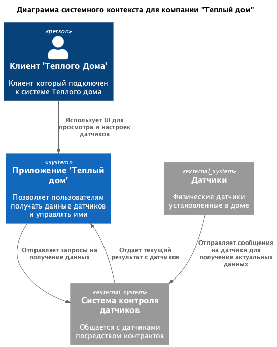
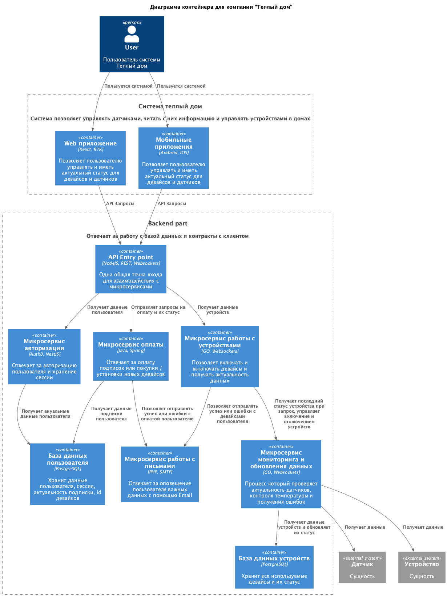
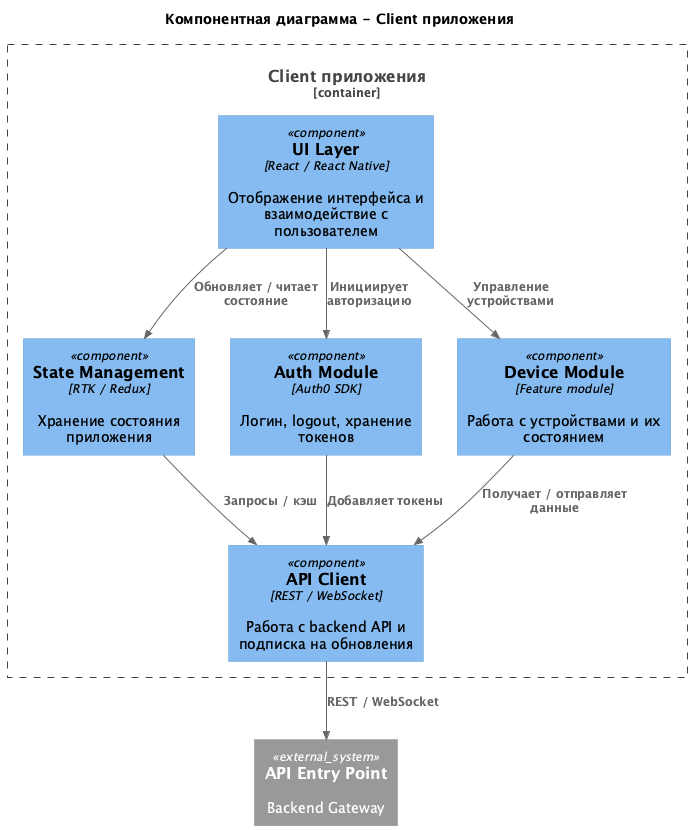
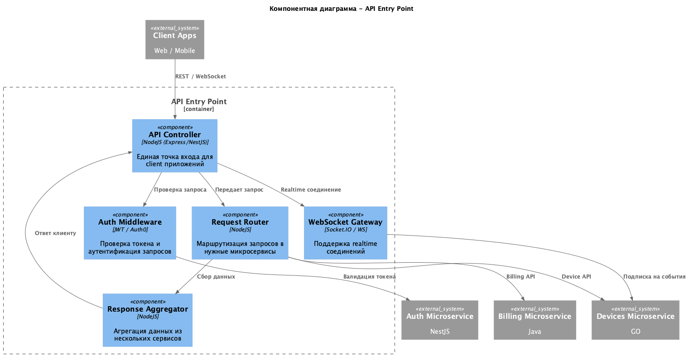
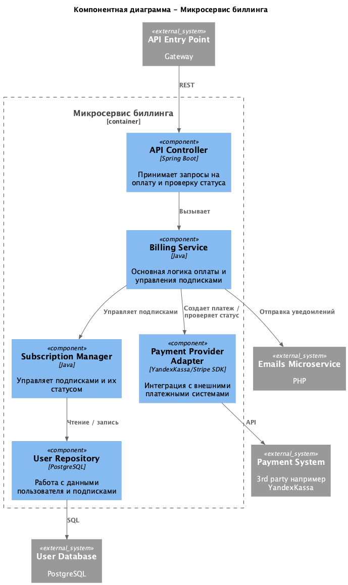
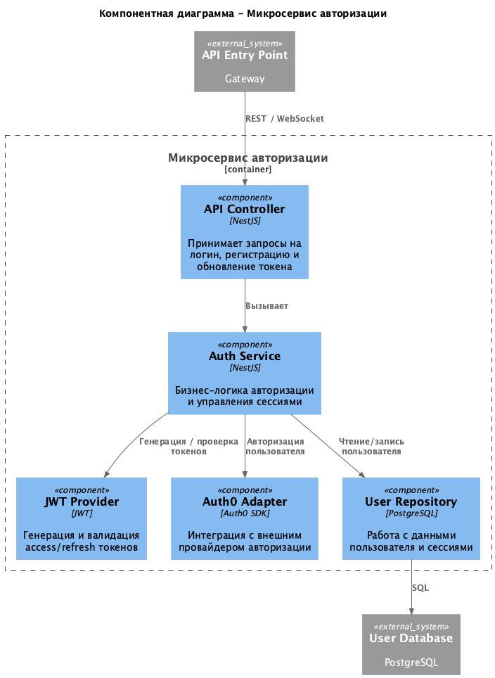
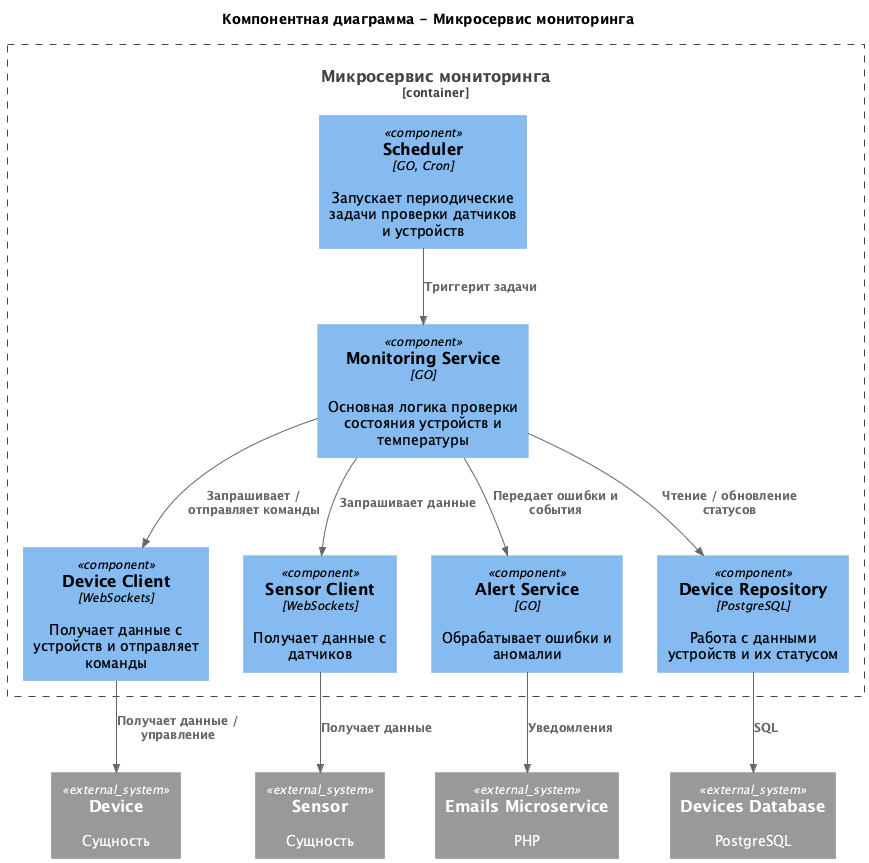
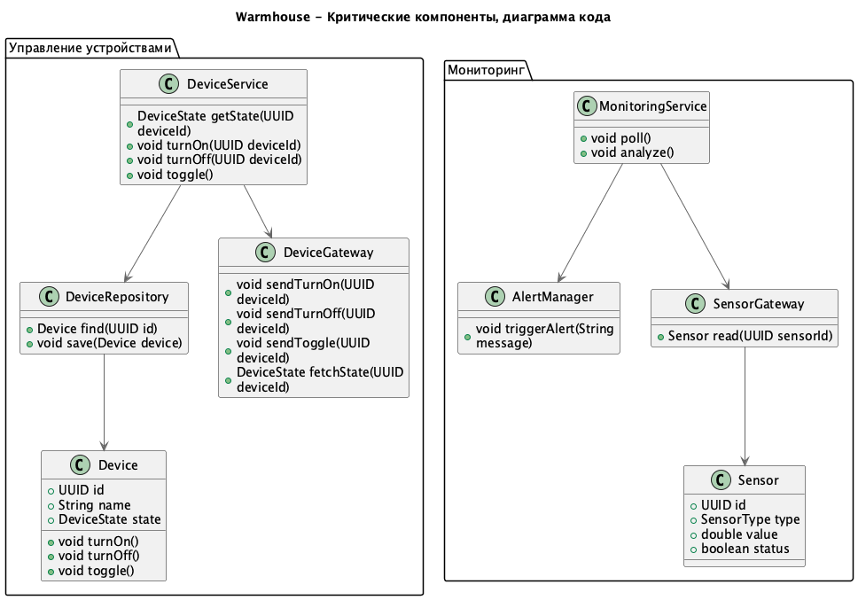
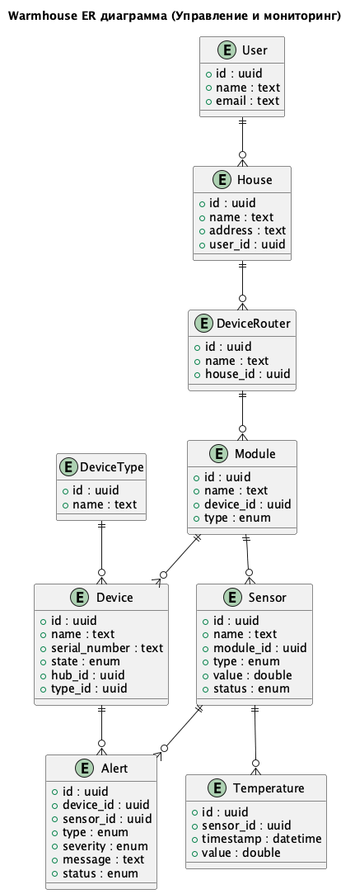

# Project_template

Это шаблон для решения проектной работы. Структура этого файла повторяет структуру заданий. Заполняйте его по мере работы над решением.

# Задание 1. Анализ и планирование

### 1. Описание функциональности монолитного приложения

**Управление отоплением:**

- Пользователи могут через веб приложение управлять теплом в своем доме
- Система поддерживает настройку новых датчиков

**Мониторинг температуры:**

- Пользователи могут получать темпуратуры с датчиков которые установлены в доме
- Система поддерживает возможность включать и выключать датчики и изменять температуру с помощью веб приложения

### 2. Анализ архитектуры монолитного приложения

Система реализована как монолитное приложение на языке Go с использованием базы данных PostgreSQL. Все компоненты (обработка запросов, бизнес-логика и работа с данными) находятся внутри одного приложения без применения выраженных архитектурных подходов. Взаимодействие в системе полностью синхронное: сервер напрямую управляет датчиками и запрашивает у них данные о температуре, в том числе через внешний REST API. При этом пользователь не может самостоятельно подключать новые устройства. Также для обновления стейта приложения нужен полный перезапуск контейнера.

### 3. Определение доменов и границы контекстов

- Web-приложение и мобильное приложение для управления домами и устройствами
- Управление модулями и сенсорами
- Телеметрия и мониторинг
- Управление модулями и сенсорами
- Алерты и уведомления

### **4. Проблемы монолитного решения**

- Масштабируемость - невозможно увеличить мощность или ресурсы только для нужного компонента, приходится масштабировать всю систему целиком
- Технический долг - с ростом монолита становится сложнее поддерживать и модернизировать код, исправление ошибок может затрагивать множество частей системы.
- Трудоёмкое развертывание - любое обновление или исправление требует останавливать и деплоить весь монолит.
- Сложности в разработке и тестировании - рост команды усложняет координацию, а изолированное тестирование компонентов почти невозможно.

### 5. Визуализация контекста системы — диаграмма С4



# Задание 2. Проектирование микросервисной архитектуры

**Диаграмма контейнеров (Containers)**



**Диаграмма компонентов (Components)**

### **1. Client component**



### **2. API component**



### **3. Billing component**



### **4. Auth component**



### **5. Monitoring component**



**Диаграмма кода (Code)**



# Задание 3. Разработка ER-диаграммы



# Задание 4. Создание и документирование API

### 1. Тип API

- REST - для синхронных действий (включить устройство, получить состояние)
- Async - для событий (алерты, телеметрия)

### 2. Документация API

- [Device Service](swagger/device-service.yaml)
- [Monitoring Service](swagger/monitoring-service.yaml)

# Задание 5. Работа с docker и docker-compose

Перейдите в apps.

Там находится приложение-монолит для работы с датчиками температуры. В README.md описано как запустить решение.

Вам нужно:

1. сделать простое приложение temperature-api на любом удобном для вас языке программирования, которое при запросе /temperature?location= будет отдавать рандомное значение температуры.

Locations - название комнаты, sensorId - идентификатор названия комнаты

```
	// If no location is provided, use a default based on sensor ID
	if location == "" {
		switch sensorID {
		case "1":
			location = "Living Room"
		case "2":
			location = "Bedroom"
		case "3":
			location = "Kitchen"
		default:
			location = "Unknown"
		}
	}

	// If no sensor ID is provided, generate one based on location
	if sensorID == "" {
		switch location {
		case "Living Room":
			sensorID = "1"
		case "Bedroom":
			sensorID = "2"
		case "Kitchen":
			sensorID = "3"
		default:
			sensorID = "0"
		}
	}
```

2. Приложение следует упаковать в Docker и добавить в docker-compose. Порт по умолчанию должен быть 8081

3. Кроме того для smart_home приложения требуется база данных - добавьте в docker-compose файл настройки для запуска postgres с указанием скрипта инициализации ./smart_home/init.sql

Для проверки можно использовать Postman коллекцию smarthome-api.postman_collection.json и вызвать:

- Create Sensor
- Get All Sensors

Должно при каждом вызове отображаться разное значение температуры

Ревьюер будет проверять точно так же.

# **Задание 6. Разработка MVP**

Необходимо создать новые микросервисы и обеспечить их интеграции с существующим монолитом для плавного перехода к микросервисной архитектуре.

### **Что нужно сделать**

1. Создайте новые микросервисы для управления телеметрией и устройствами (с простейшей логикой), которые будут интегрированы с существующим монолитным приложением. Каждый микросервис на своем ООП языке.
2. Обеспечьте взаимодействие между микросервисами и монолитом (при желании с помощью брокера сообщений), чтобы постепенно перенести функциональность из монолита в микросервисы.

В результате у вас должны быть созданы Dockerfiles и docker-compose для запуска микросервисов.
